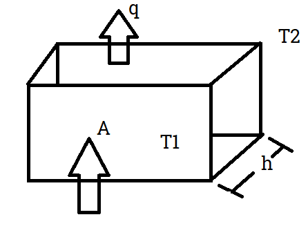
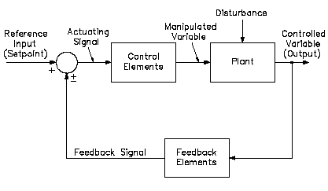
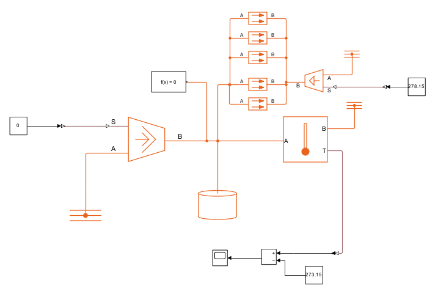
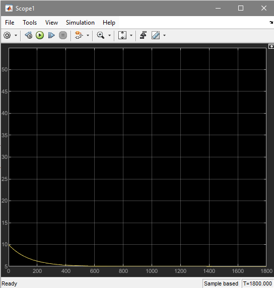
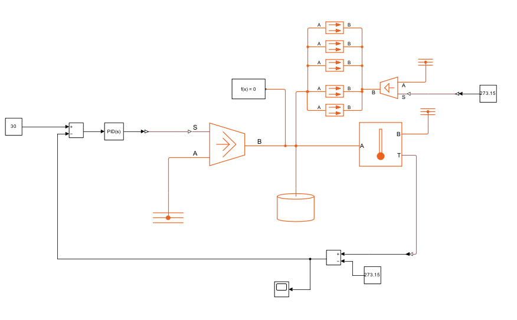
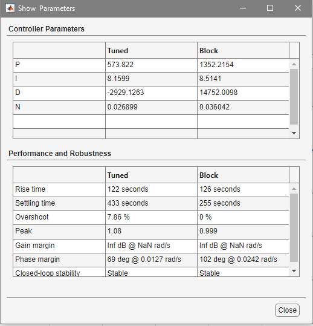
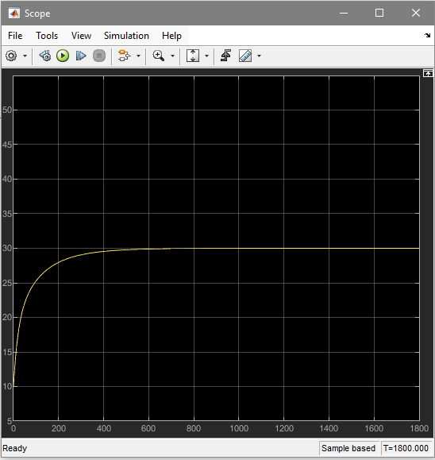
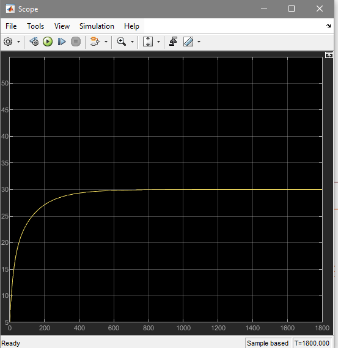

# PID-Controller-Design-for-Room-Temperature
## Abstract
This project focuses on the design and implementation of a Proportional-Integral-Derivative (PID) controller to regulate the temperature of a room containing a heater. The system model incorporates the dynamics of heat transfer between the inside and outside environments, considering the effect of ambient temperature on the room's thermal stability. A simulation of the system is conducted using Simulink, where the PID controller is tuned to minimize the error between the desired user-defined temperature and the actual room temperature. The controller dynamically adjusts the heater's output to maintain the target temperature, compensating for fluctuations caused by external disturbances. The results demonstrate the effectiveness of the PID controller in achieving steady-state temperature control and minimizing temperature overshoot and settling time. This simulation provides a foundational framework for designing energy-efficient heating systems for residential and industrial applications.

## Objectives
1.	Design a Temperature Control System: Develop a PID controller to regulate the room temperature by dynamically adjusting the heater's output.
2.	Model Heat Transfer Dynamics: Simulate the interaction between the indoor and outdoor temperatures and how external disturbances affect the room's thermal stability.
3.	Minimize Temperature Error: Achieve precise temperature control by reducing the error between the desired user-defined temperature and the actual temperature.
4.	Optimize Controller Performance: Tune the PID parameters to ensure stability, minimal overshoot, and reduced settling time for the system.
5.	Enhance Energy Efficiency: Evaluate the system's performance in maintaining the desired temperature while minimizing energy consumption.
6.	Develop a Scalable Framework: Provide a model that can be adapted to different heating systems and environments for both residential and industrial applications.
7.	Validate the Controller: Simulate the system using Simulink to assess the effectiveness of the PID controller under various operating conditions and disturbances.

## Background Theory
A thermal system is a physical system that involves the transfer, storage, and transformation of thermal energy (heat). It consists of components like solid bodies, fluids, or gases through which heat flows due to temperature differences. In thermal systems, the primary goal is often to manage temperature or energy distribution for heating, cooling, or maintaining equilibrium.
Heat can flow between Objects in three main mechanisms:
1.	Conduction: This is the transfer of heat through direct contact. In conduction, heat flows from the hotter part of an object to the cooler part via vibrations of atoms and free electrons. It is common in solids, especially metals, which have high thermal conductivity. For example, when you touch a metal spoon that’s in a hot pot, heat travels from the spoon’s end in the pot to the handle through conduction.
2.	Convection: This is the transfer of heat by the movement of a fluid (liquid or gas). As the fluid near a heat source warms up, it becomes less dense and rises, while cooler, denser fluid moves down to take its place. This continuous cycle creates a convection current that transfers heat. Convection is common in fluids, such as the heating of water in a pot or the warming of air by a heater.
3.	Radiation: Heat transfer by radiation involves the emission of electromagnetic waves (infrared radiation) from a surface. This mechanism does not require a medium and can occur in a vacuum. For example, the Sun transfers heat to Earth through radiation across the vacuum of space. Surfaces with high emissivity, like black surfaces, radiate more heat than those with low emissivity, like shiny surfaces.

In a thermal system, these mechanisms often work together. For instance, in a home heating system, a radiator heats the air through conduction, and the warm air circulates via convection, while some heat is also radiated into the room.

- A: Area of Surface
- h: Thickness of the Wall
- q: Heat Flow
- delatT = T2 - T1 = Rtq where Rt is the Thermal Resistance
- During heat transfer between materials: Each Material has a Thermal Capacitance where q = C dT/dt and C = mc where c is the specific heat.

## Scenario of the Project
We have a room of area 12m2 and the thickness of the walls is 0.2 m, with a mass of 60 kg. The thermal conductivity between the walls is 1.43 W/mk and the specific heat c = 1.005 J/kg.K.
A heater is installed inside the room, and a temperature sensor measures both the internal and external temperatures. Heat transfer occurs from the outside to the inside, indicating that the external temperature influences the internal temperature of the room.
 Our aim is to measure the difference between these temps and tune a PID controller in order to dynamically keep the room temperature as intended regardless of how the temperature outside is.

### Block Diagram of the System:
 

 - Input Signal / Reference: Is the desired room temperature
 - Controller: PID
 - Plant: Heater, room, walls
 - Disturbance: The outside temperature
 - Feedback Element: Temperature Sensor

### Open Loop System:
The below schematic shows the open loop configuration of the system without the controller using SIMULINK:

Assuming the Room temperature is T1 = 10 degC and the outsied temperature T2 = 5 degC and the heater is not working we can see the following:

We can see that a heat transfer occurs between the room and the outside via the walls, which causes the room temperature to decrease drastically from 10 to 5 degC in approximately 10 minutes.

### Closed Loop System
Adding The PID Controller and Closing the System:

After Tuning the Controller we got the following params:

An input Temperature of 30 degC is given to the system and we got the following result:

The room temperature increased from 10 degC to the desired one at 30 degC in about 6 mins and then the controller kept the room temperature as intended.

### Simulating under different circumstances:
Toutside = -5 degC
Troom = 5 degC

#### Result

The controller was able to increase the Troom to the desired temperature regardless of the circumstances.

## Conclusion
The PID controller successfully regulated the system under varying initial conditions and external disturbances. It demonstrated effective temperature control, maintaining the desired room temperature (30°C) regardless of external conditions, such as an initial room temperature of 5°C and an outside temperature of -5°C. This showcases the robustness and reliability of the PID controller in dynamic and challenging environments.

### Advantages of Using a PID Controller
1. Systematic Advantages:
- - Precision Control: The PID controller ensures accurate tracking of the desired temperature, minimizing overshoot and steady-state error.
  - Robustness: The system adapts to environmental disturbances (e.g., changes in outside temperature) without requiring manual recalibration.
  - Efficiency: Continuous adjustments reduce thermal lag and prevent excessive fluctuations, maintaining comfort.
2. Financial Benefits:
- - Energy Savings: Precise control prevents overuse of heating resources, reducing energy consumption and costs.
  - Reduced Maintenance Costs: By ensuring smooth system operation, the PID controller minimizes wear on mechanical and electrical components, extending their lifespan.
  - Cost-Effectiveness: The ability to adapt to various conditions eliminates the need for expensive auxiliary systems to compensate for external disturbances.

This implementation demonstrates the PID controller's value as a cost-effective and systematic solution for achieving reliable and efficient temperature regulation in real-world applications.

 
 

